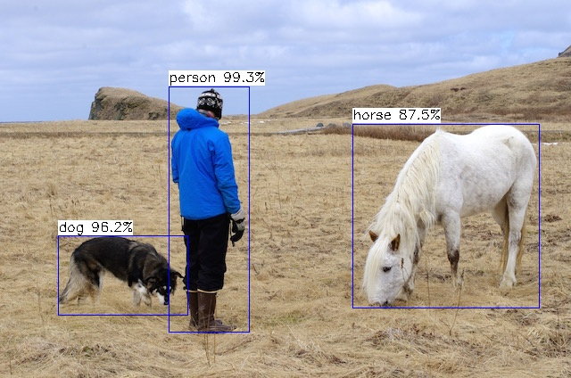
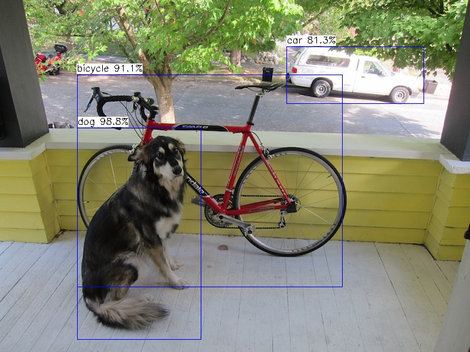

# Thundernet ncnn

## the C++ version of thundernet with ncnn

在[ncnn](https://github.com/Tencent/ncnn)编译对应环境库替换include和lib


## 检测结果
欢迎各位开发者移植到移动端，并测试贡献耗时

本耗时测试为macos 单线程

MobileNetV2-YOLOv3 (来自ncnn bencnmark)

|  input   shape           |      mAP      |  cost(ms)   
|--------------------|:-------------:|:-------------:|
| 352*352         | 0.715            |       67.79      |

thundernet_shufflenetv2_15_voc

|  input   shape           |      mAP      |  cost(ms)   
|--------------------|:-------------:|:-------------:|
| 320*320         | 0.712            |     57.57        | 
| 352*352         | 0.722           |   64.33        | 
| 384*384         | 0.734            |  73.63            | 
| 416*416         | 0.738           |  89.28        | 
| 448*448         | 0.744           |  97.97           | 
| 480*480         | 0.747           |  110.04           | 


thundernet_shufflenetv2_15_voc_fpn

|  input   shape           |      mAP      |   cost(ms)  | 
|--------------------|:-------------|:-------------|  
| 320*320         | 0.73            |  74.83      | 


thundernet_shufflenetv2_15_v2_voc （使用了coco预训练模型）

 input   shape           |      mAP      |    cost(ms)  | 
|--------------------|:-------------:|:-------------|  
| 320*320         | 0.749            | 65.98      | 
| 480*480         | 0.778            | 137.65        | 


thundernet_shufflenetv2_15_v2_coco

|  input   shape           |      AP(0.5:0.95)      |   cost(ms)  |    
|--------------------|:-------------:|:-------------|  
| 320*320         | 0.22            | 72.68      | 


```
mkdir build
cd build 
cmake ..
make 
./thundernet_voc ../imgs/person.jpg
./thundernet_fpn_voc ../imgs/person.jpg
./thundernet_coco ../imgs/person.jpg
```

## 检测结果展示




